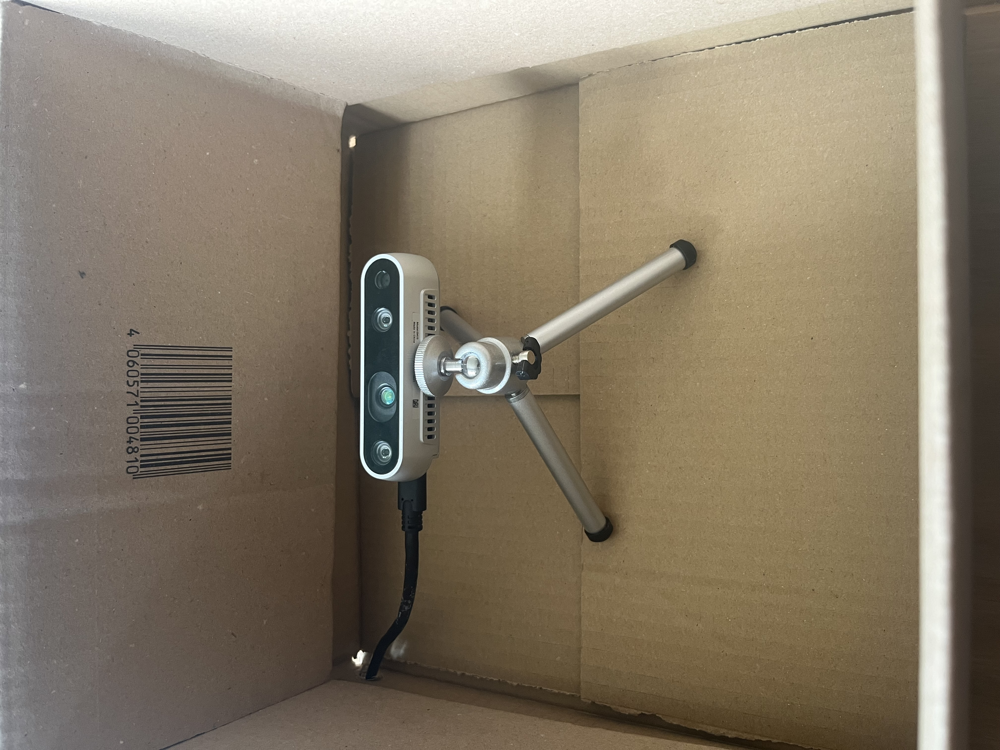
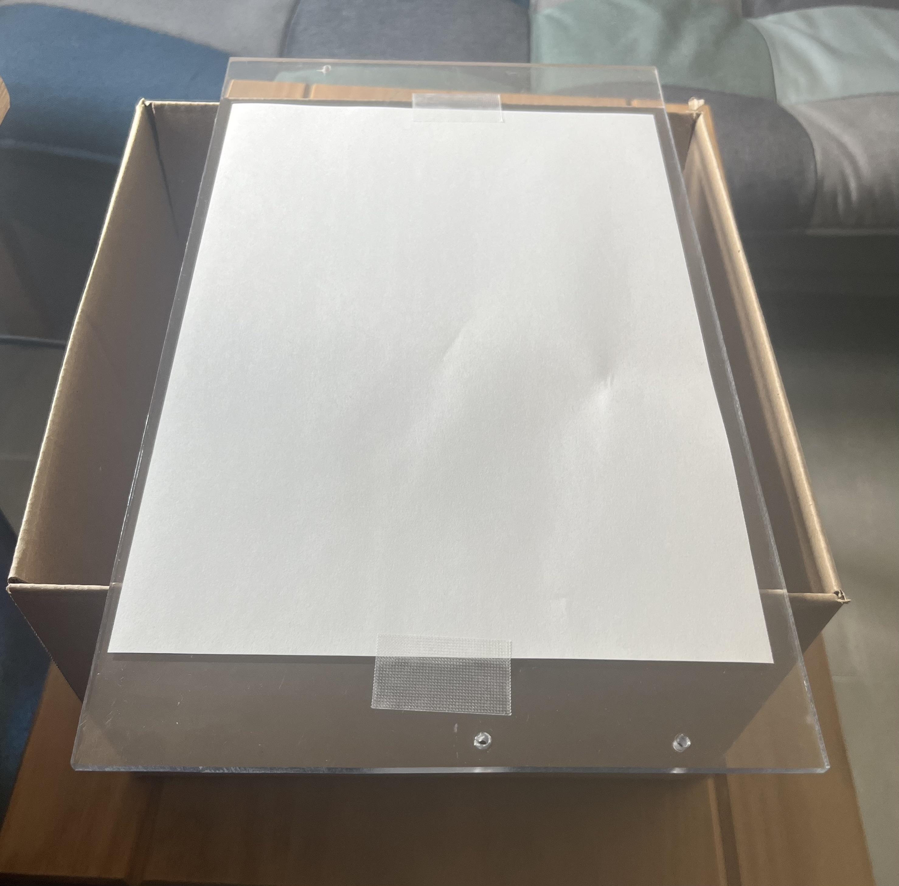
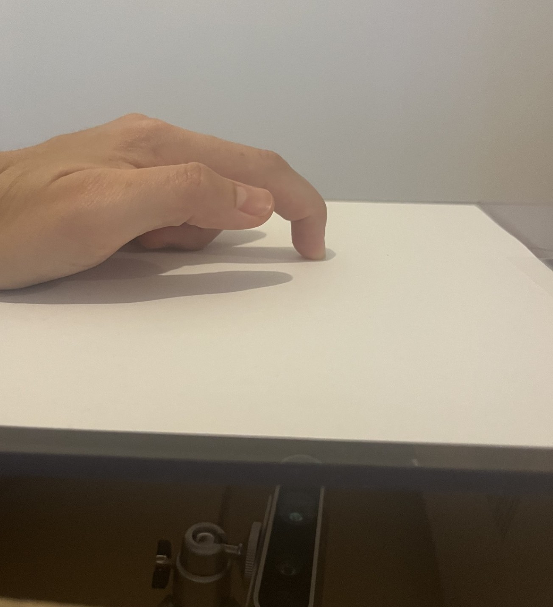
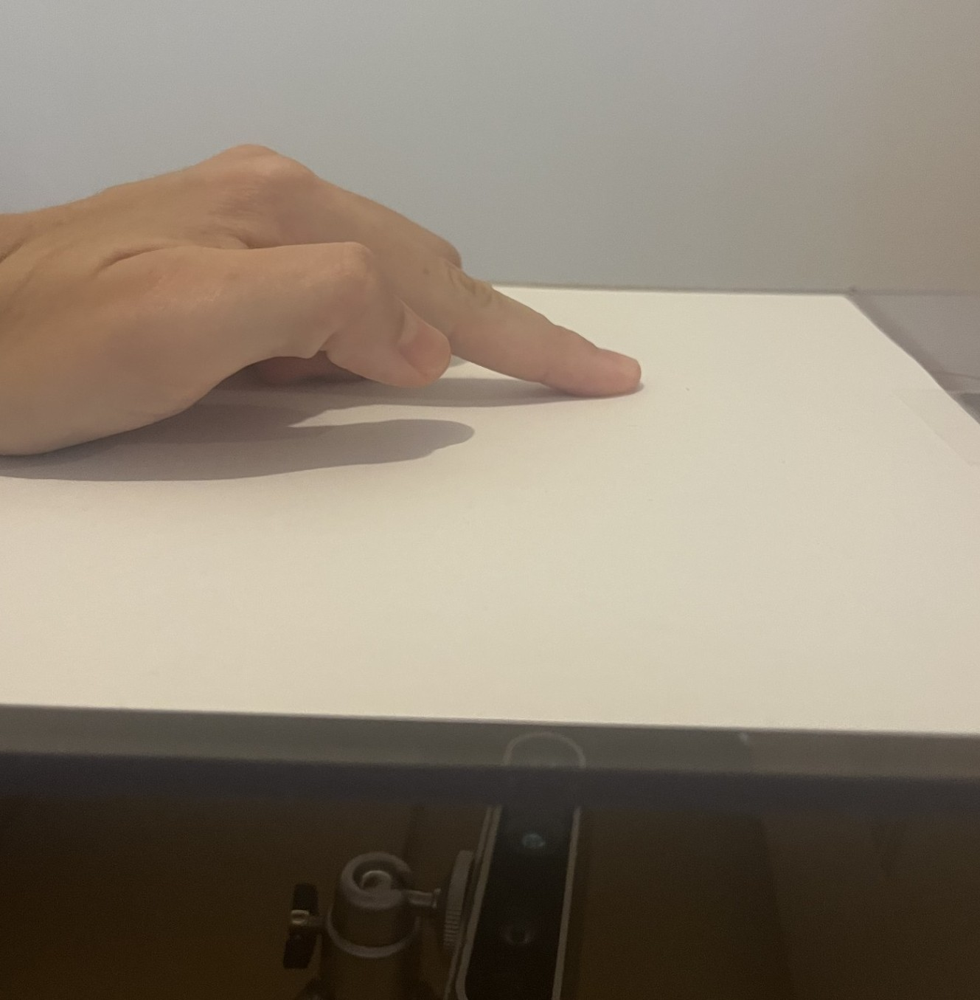

# Prerequisites

**Note**: This program was developed and tested with Python 3.11.x.

- Create and run a virtual environment (on Windows):
    ```
    py -m venv venv
    venv\Scripts\activate
    ```

- Install requirements:

    ```
    pip install -r requirements.txt
    ```


# 1. Build a Camera-Based Touch Sensor

## Initial Difficulties

I started working on this assignment using my old laptop, since that was all I had available at the time. I had to use the short USB cable that came with the camera, and when I tried connecting the camera, my laptop would not recognize it. I spent hours thinking the camera or the cable had a loose connection. *Sometimes*, after carefully unplugging and plugging it back in and not moving the camera too much, it would work. Since I couldn't swap the camera, I tried to make do. Later, after switching to my desktop computer, I realized that the issue was not with the camera or the cable. It was my laptop not supplying enough power for the camera to function properly. (The times it worked was when the laptop was plugged into the power outlet, but somehow I didn't make that connection.)


## Design Decisions

The USB cable that came with the camera was not long enough to reach inside the carboad box from my laptop. So, I poked a hole through the box to feed the cable through.

In the beginning, I simply placed the camera on the bottom of the box, but later I realized that using the tripod greatly reduced noise since it limited the view to just the sheet of paper. Extending the tripod legs outward to get the camera as close to the ground as possible still maintained a wide enough field of view. Additionally, I taped the piece of paper to the acrylic to keep it from shifting.

Camera inside the box    |  Box covered with acrylic and paper sheets
-------------------------|-------------------------
  |  

To avoid false positives from palms or other large objects, any contact detected at the edges of the camera frame is ignored.

To detect taps, I first tried using different bounding box size thresholds around the fingerpad, which was not reliable. I ended up using a time-based approach: when a finger touches the surface, a timer starts, and if the finger is lifted within a certain time threshold, the movement is registered as a tap.

- calibration


## How To Use

To learn about setting up the hardware, please refer to the [Design Decisions](#design-decisions) section. (Make sure the camera orientation matches that of the reference image to avoid unexpected behavior.)

Run the program with the following commands:

```
py touch_input.py
py fitts_law.py [num_targets] [width] [distance] [id]   # Replace with actual values
```

Calibration will start upon running the program. Make sure to keep the surface clear during this process.

Three windows will open: One pyglet window and two camera preview windows. The two camera windows display the threshold image and the color image with a bounding box drawn around a detected fingerpad.

To control the green cursor in the pyglet window, drag the pad of your finger across the sheet of paper. To select a red target, move the cursor over it and tap your finger on the surface. Once all targets have been hit, log data will be saved to a .csv file.

To close the preview windows, press the **Q** key. To exit the pyglet window, click the **X** button.

### Finger Posture
bad    |  good
-------------------------|-------------------------
  |  


# 2. Touch-based Text Input

## Decisions decisions

I decided to use the EMNIST dataset because it's easily accessible and offers a lot of diverse data. I initially used the *Balanced* set which contains all digits 0-9 as well as all uppercase and some lowercase letters. However, the *Balanced* set merges certain lowercase letters with their uppercase counterparts due to close visual resemblance (e.g., c and C). This results in inconsistent representation, with some characters appearing in both cases and others appearing only in uppercase. Since I wanted to keep it consistent, and the recognizer had trouble distinguishing between certain digits and letters (e.g., mistaking O for 0 or S for 5), I decided to use the *Letters* set instead.

At first, I omitted the tap functionality I implemented in [Task 1](#1-build-a-camera-based-touch-sensor), thinking I wouldn't need it. However, it turned out that the tap functionality was perfect for simulating the **SPACE** bar.

When a movement (as defined in part 1 of the assignment) is detected, white strokes are drawn on the camera preview window to provide visual feedback. Once the user lifts their finger off the surface, a 1-second timer starts to allow for multi-stroke characters (such H, A or E) where the user may need to touch the surface more than once. If no further input is detected during this interval, the input is placed into a square to preserve aspect ratio, resized to match the input size of the model, and normalized and reshaped. The input is then predicted and the result simulated as a keystroke.

When a tap is detected, the canvas is cleared right away to avoid accidental prediction, and a **SPACE** keystroke is simulated.

## How To Use

To learn about setting up the hardware, please refer to the [Design Decisions](#design-decisions) section. (Make sure the camera orientation matches that of the reference image to avoid unexpected behavior.)

Run the program with the following commands:

```
cd text_input
py touch_input.py
```

Calibration will start upon running the program. Make sure to keep the surface clear during this process.

A camera preview window will open. Drag your fingerpad over the surface. Your strokes will appear in white in the preview window. After you finish writing a character, pause for one second without touching the surface. The character will then be recognized and typed automatically. After that, you can proceed with the next character. Briefly tapping your finger on the surface once will simulate a **SPACE** keystroke.

To end the program, press the **Q** key.